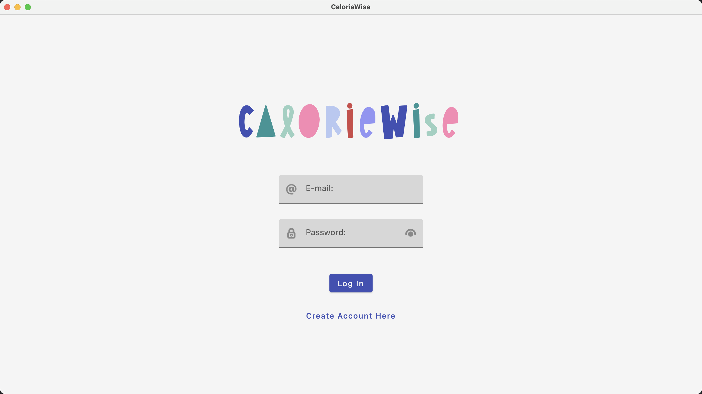

# CalorieWise

_Note: Please use the backup installer if the original one does is not supported on your MAC._

**Project Description**: CalorieWise is a desktop app that aims to help users better track their diet in order to manage their health more efficiently. The app provides an easy-to-use calorie tracker, breakdowns of your nutrient intake, and an intake/exercise entry page for you to get an overview of your daily calorie consumption. Furthermore, the app recommends a healthy calorie total to better guide you on your wellness journey, which can be updated anytime. Welcome to CalorieWise!

.png)
.png)
.png)
.png)
.png)
.png)
.png)
.png)

## Team Names and Contact Info:
- Dongni Lu - d55lu@uwaterloo.ca
- Lynn Li - j2557li@uwaterloo.ca
- Peter Li - j2457li@uwaterloo.ca
- Yingjia Zhang - y3457zha@uwaterloo.ca 

